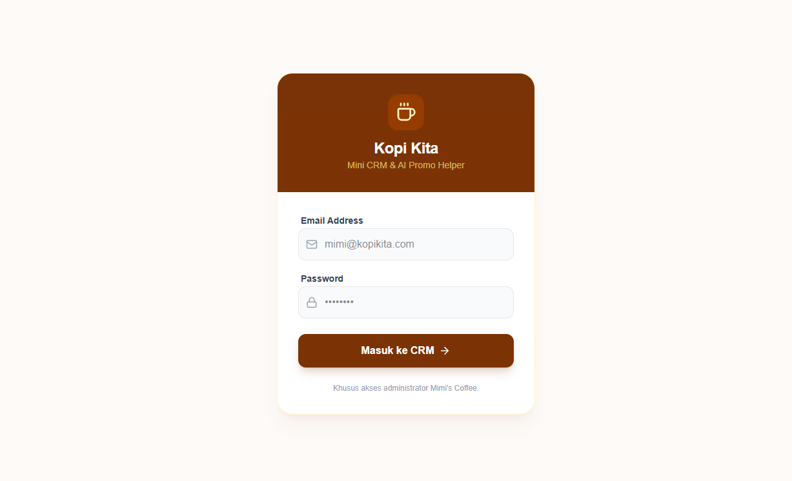
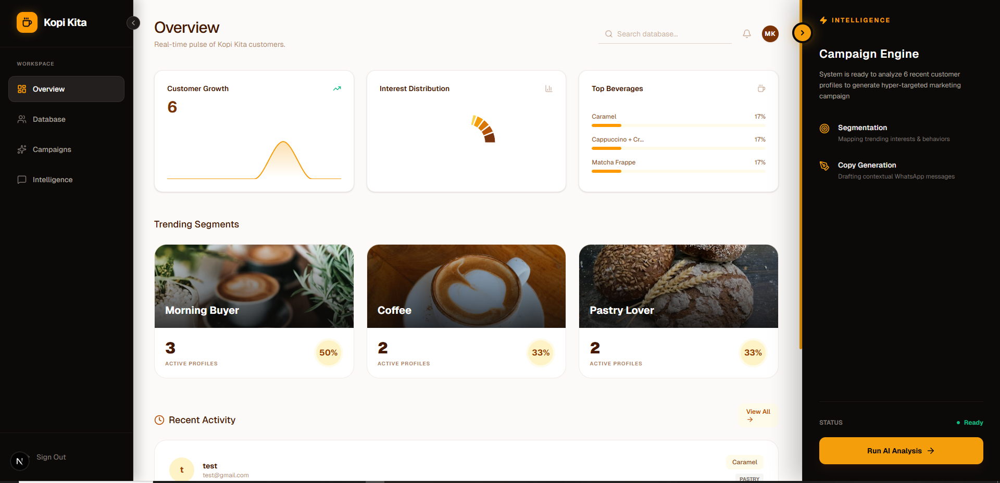
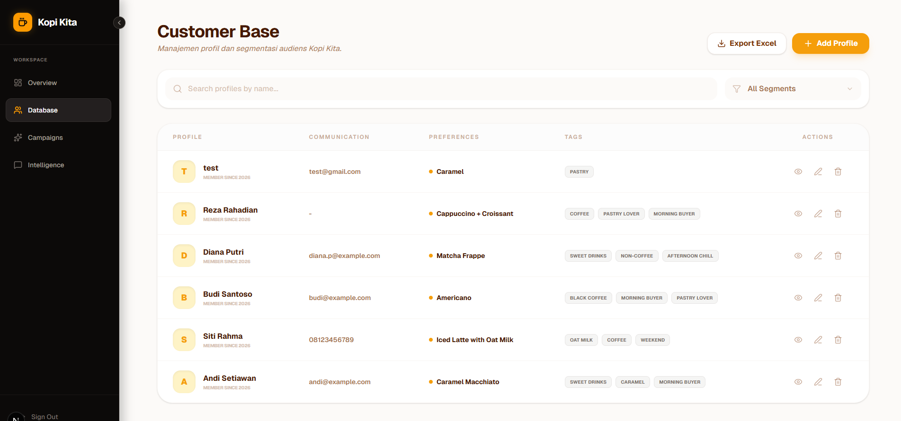
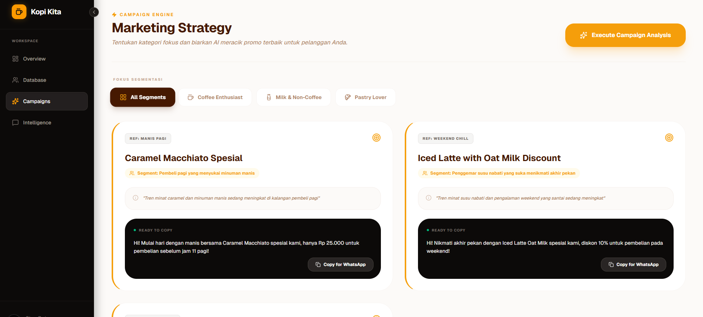
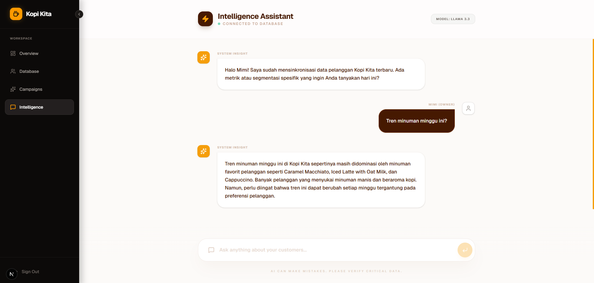

# Kopi Kita CRM - AI Global Promo Helper

**Live Demo:** [https://web-coffe-kita-llm.vercel.app/](https://web-coffe-kita-llm.vercel.app/)

---
## Tech Stack

* **Framework:** [Next.js](https://nextjs.org)
* **Database:** [Neon](https://neon.tech/) (Serverless Postgres)
* **ORM:** [Prisma](https://www.prisma.io/)
* **AI Model:** [Groq](https://groq.com/)
* **Styling:** [Tailwind CSS](https://tailwindcss.com/)

## App Screenshots

### Login Page


### Dashboard Page


### Database Page


### Campaign Page


### Chat AI Page


---

This is a [Next.js](https://nextjs.org) project bootstrapped with [`create-next-app`](https://nextjs.org/docs/app/api-reference/cli/create-next-app).

## Getting Started

First, run the development server:

```bash
npm run dev
# or
yarn dev
# or
pnpm dev
# or
bun dev
```

Open http://localhost:3000 with your browser to see the result.

You can start editing the page by modifying app/page.tsx. The page auto-updates as you edit the file.

This project uses next/font to automatically optimize and load Geist, a new font family for Vercel.

